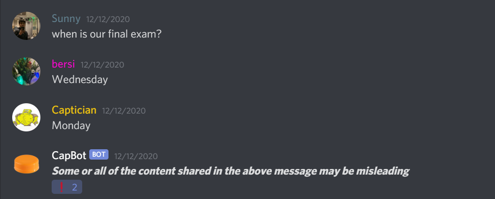

#  CapBot
> Discord bot that reponds with disclaimer to a specific user

## Table of Contents
* [General Info](#general-info)
* [Images](#images)
* [Skills](#skills)
* [Status](#status)
* [Contribution](#contribution)
* [Helpful Resources](#helpful-resources)
* [Meta](#meta)
* [Reflection](#reflection)

## General Info

CapBot is a Discord bot that was created to respond to a particular
user who would always find a way to twist the truth. I consider this 
a gift to humanity as no person will ever again be fooled by his
lies about there being a "6th question on the back" (bear in mind
our worksheets are online and cannot have a "back").

## Images

## Skills

- Python
- Discord API
- Heroku

## Status

*Completed*

## Contribution

1. Fork it (<https://github.com/matthewfoulk/cuttle/fork>)
2. Create your feature branch (`git checkout -b feature/fooBar`)
3. Commit your changes (`git commit -am 'Add some fooBar'`)
4. Push to the branch (`git push origin feature/fooBar`)
5. Create a new Pull Request

## Helpful Resources

- [RealPython.com: How to Make a Discord Bot in Python](https://realpython.com/how-to-make-a-discord-bot-python/)
- [StackOverflow.com: How do I host my Discord.py Bot on Heroku?](https://stackoverflow.com/questions/52247301/how-do-i-host-my-discord-py-bot-on-heroku)

## Meta

Matthew Foulk – [LinkedIn](https://www.linkedin.com/in/matthew-foulk-a7a24318a/) – matthewrfoulk@gmail.com

Distributed under the MIT license. See ``LICENSE`` for more information.

## Reflection

Start Date: 12/12/2020  
End Date: 12/12/2020  

This was a fun, quick project. I enjoyed familiarizing myself
with the Discord API (although I barely scraped the surface of what
is possible). I've had a lot of fun recently making several projects
that I actually find useful in my daily life. The hardest part 
of this project was realizing that my bot was not broken, I 
simply had to actually turn on the dyno on Heroku.